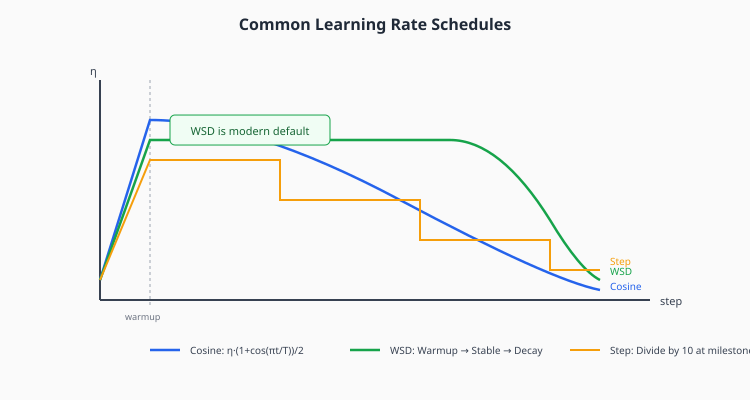

# Chapter 8: Learning Rate Schedules

Learning rate schedules control how the learning rate changes during training. The right schedule can significantly impact both convergence speed and final model quality.

## Table of Contents

1. [Why Schedules Matter](#why-schedules-matter)
2. [Warmup](#warmup)
3. [Decay Strategies](#decay-strategies)
4. [Warmup-Stable-Decay (WSD)](#warmup-stable-decay-wsd)
5. [Cosine Annealing](#cosine-annealing)
6. [Batch Size and Learning Rate](#batch-size-and-learning-rate)
7. [Implementation](#implementation)
8. [Exercises](#exercises)

---

## Why Schedules Matter



A fixed learning rate faces a dilemma:
- **Too high**: Oscillates or diverges, especially early in training
- **Too low**: Converges slowly, may get stuck

The solution: **vary the learning rate during training**.

### Key Intuition

- **Early training**: Parameters are random, loss is high. Can use larger learning rate.
- **Late training**: Near optimum, need smaller steps for fine-tuning.

---

## Warmup

### Why Warmup?

At the start of training:
1. Parameters are random → gradients can be large and unstable
2. Optimizer state (momentum, Adam's $v$) is uninitialized
3. Large learning rate can cause divergence

**Solution**: Start with small $\eta$ and gradually increase.

### Linear Warmup

The most common approach:

$$\eta(t) = \eta_{\max} \cdot \frac{t}{T_{\text{warmup}}}$$ for $t < T_{\text{warmup}}$

Typical warmup: 1-5% of total training steps.

### When Warmup is Critical

- **Large batch sizes**: More noise averaging → need more warmup
- **Transformers**: Attention layers are especially sensitive early on
- **Adam optimizer**: Moment estimates need time to stabilize

---

## Decay Strategies

### Step Decay

Divide learning rate by a factor at fixed intervals:

$$\eta(t) = \eta_0 \cdot \gamma^{\lfloor t / T_{\text{step}} \rfloor}$$

Common: $\gamma = 0.1$ at epochs 30, 60, 90 (historical from ResNet papers).

**Pros**: Simple, interpretable
**Cons**: Discontinuous, requires tuning milestones

### Exponential Decay

$$\eta(t) = \eta_0 \cdot e^{-\lambda t}$$

**Pros**: Smooth
**Cons**: Decays too fast early, too slow late

### Polynomial Decay

$$\eta(t) = \eta_{\min} + (\eta_{\max} - \eta_{\min}) \cdot \left(1 - \frac{t}{T}\right)^p$$

$p = 1$: Linear decay
$p = 2$: Faster initial decay

---

## Warmup-Stable-Decay (WSD)

The **modern default** for LLM training:

```
Phase 1 (Warmup):  Linear increase from 0 to η_max
Phase 2 (Stable):  Constant at η_max (majority of training)
Phase 3 (Decay):   Cosine decay to η_min
```

Typical split: 5% warmup, 80% stable, 15% decay.

### Why WSD Works

- **Long stable phase**: Most training happens at high learning rate
- **Final cooldown**: Fine-tunes to lower loss
- **Used by**: LLaMA, GPT-4, most modern LLMs

### Implementation

```python
def wsd_schedule(step, warmup_steps, stable_steps, decay_steps, max_lr, min_lr=0):
    if step < warmup_steps:
        return max_lr * step / warmup_steps
    elif step < warmup_steps + stable_steps:
        return max_lr
    else:
        decay_step = step - warmup_steps - stable_steps
        return min_lr + (max_lr - min_lr) * 0.5 * (
            1 + math.cos(math.pi * decay_step / decay_steps)
        )
```

---

## Cosine Annealing

The classic smooth schedule:

$$\eta(t) = \eta_{\min} + (\eta_{\max} - \eta_{\min}) \cdot \frac{1 + \cos(\pi t / T)}{2}$$

### Properties

- Smooth decay from $\eta_{\max}$ to $\eta_{\min}$
- Derived from simulated annealing theory
- **The standard before WSD**

### With Warm Restarts

Multiple cosine cycles that restart to high learning rate:

$$\eta(t) = \eta_{\min} + (\eta_{\max} - \eta_{\min}) \cdot \frac{1 + \cos(\pi t_i / T_i)}{2}$$

where $t_i$ is time within current cycle.

Motivation: Escape local minima by periodically increasing learning rate.

---

## Batch Size and Learning Rate

### Linear Scaling Rule

When increasing batch size $B \to kB$, scale learning rate $\eta \to k\eta$.

**Intuition**: Larger batches have lower variance gradients, so can take larger steps.

**Limits**: Works up to a "critical batch size" beyond which more parallelism doesn't help.

### Square Root Scaling

More conservative: $\eta \propto \sqrt{B}$

Used when linear scaling causes instability.

### LARS/LAMB for Very Large Batches

Layer-wise adaptive scaling for batch sizes 32K+:

$$\eta_l = \eta \cdot \frac{\|\theta_l\|}{\|g_l\| + \lambda \|\theta_l\|}$$

Enables training BERT in 76 minutes with 64K batch size.

---

## Implementation

```python
import math
from typing import Optional


class WarmupCosineScheduler:
    """
    Warmup + cosine decay learning rate scheduler.

    This is the classic schedule for transformer training.
    """

    def __init__(
        self,
        optimizer,
        warmup_steps: int,
        total_steps: int,
        min_lr: float = 0.0
    ):
        self.optimizer = optimizer
        self.warmup_steps = warmup_steps
        self.total_steps = total_steps
        self.min_lr = min_lr
        self.base_lrs = [pg['lr'] for pg in optimizer.param_groups]
        self.step_count = 0

    def step(self):
        self.step_count += 1
        lr = self.get_lr()

        for i, pg in enumerate(self.optimizer.param_groups):
            pg['lr'] = lr

    def get_lr(self):
        if self.step_count < self.warmup_steps:
            # Linear warmup
            return self.base_lrs[0] * self.step_count / self.warmup_steps
        else:
            # Cosine decay
            progress = (self.step_count - self.warmup_steps) / (
                self.total_steps - self.warmup_steps
            )
            return self.min_lr + (self.base_lrs[0] - self.min_lr) * 0.5 * (
                1 + math.cos(math.pi * progress)
            )


class WSDScheduler:
    """
    Warmup-Stable-Decay (WSD) learning rate scheduler.

    The modern default for LLM training:
    - Warmup: Linear increase to max_lr
    - Stable: Constant at max_lr (majority of training)
    - Decay: Cosine decay to min_lr
    """

    def __init__(
        self,
        optimizer,
        warmup_steps: int,
        stable_steps: int,
        decay_steps: int,
        max_lr: float,
        min_lr: float = 0.0
    ):
        self.optimizer = optimizer
        self.warmup_steps = warmup_steps
        self.stable_steps = stable_steps
        self.decay_steps = decay_steps
        self.max_lr = max_lr
        self.min_lr = min_lr
        self.step_count = 0

    def step(self):
        self.step_count += 1
        lr = self.get_lr()

        for pg in self.optimizer.param_groups:
            pg['lr'] = lr

    def get_lr(self):
        if self.step_count < self.warmup_steps:
            # Warmup phase
            return self.max_lr * self.step_count / self.warmup_steps
        elif self.step_count < self.warmup_steps + self.stable_steps:
            # Stable phase
            return self.max_lr
        else:
            # Decay phase
            decay_step = self.step_count - self.warmup_steps - self.stable_steps
            progress = decay_step / self.decay_steps
            return self.min_lr + (self.max_lr - self.min_lr) * 0.5 * (
                1 + math.cos(math.pi * min(progress, 1.0))
            )


# Demonstration
if __name__ == "__main__":
    import torch

    model = torch.nn.Linear(10, 10)
    optimizer = torch.optim.AdamW(model.parameters(), lr=3e-4)

    total_steps = 10000
    scheduler = WSDScheduler(
        optimizer,
        warmup_steps=500,
        stable_steps=7500,
        decay_steps=2000,
        max_lr=3e-4,
        min_lr=3e-5
    )

    lrs = []
    for _ in range(total_steps):
        lrs.append(scheduler.get_lr())
        scheduler.step()

    print(f"LR at step 0: {lrs[0]:.2e}")
    print(f"LR at step 500: {lrs[500]:.2e}")
    print(f"LR at step 5000: {lrs[5000]:.2e}")
    print(f"LR at step 9999: {lrs[9999]:.2e}")
```

---

## Key Takeaways

1. **Warmup prevents early training instability**, especially for large batches and transformers

2. **WSD is the modern default**: Warmup → Stable (majority) → Cosine decay

3. **Cosine annealing** provides smooth decay from max to min learning rate

4. **Linear scaling rule**: When batch size increases $k\times$, increase $\eta$ by $k\times$

5. **Schedule choice matters less** than getting warmup right and having some decay

---

## Exercises

### Exercise 1: Implement All Schedules

Implement step decay, exponential decay, cosine, and WSD. Plot them all on the same axes.

### Exercise 2: Warmup Importance

Train a transformer with and without warmup. Compare:
- Training curves (does it diverge without warmup?)
- Final loss

### Exercise 3: Linear Scaling Rule

Verify the linear scaling rule: Train with batch sizes 32, 64, 128, 256 and appropriately scaled learning rates. Compare final losses.

### Exercise 4: WSD Hyperparameters

Experiment with different WSD phase ratios (e.g., 10-70-20 vs 5-80-15). Which works best?

---

## Connections

- **Previous**: [Muon](07-muon.md) — schedule interacts with optimizer choice
- **Next**: [Practical Optimization](09-practical.md) — putting it all together
- **Related**: Batch size interacts with schedule (covered here)
